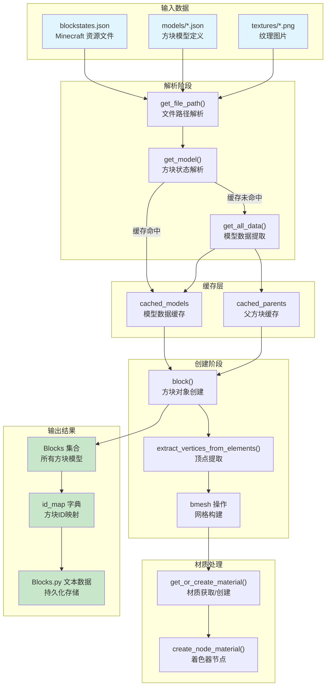
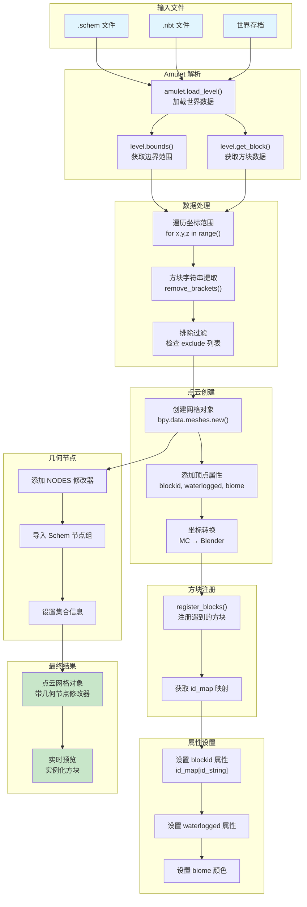
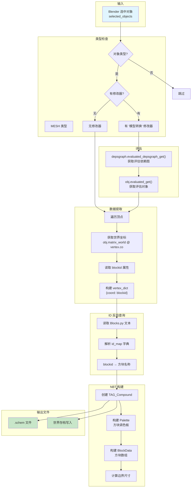
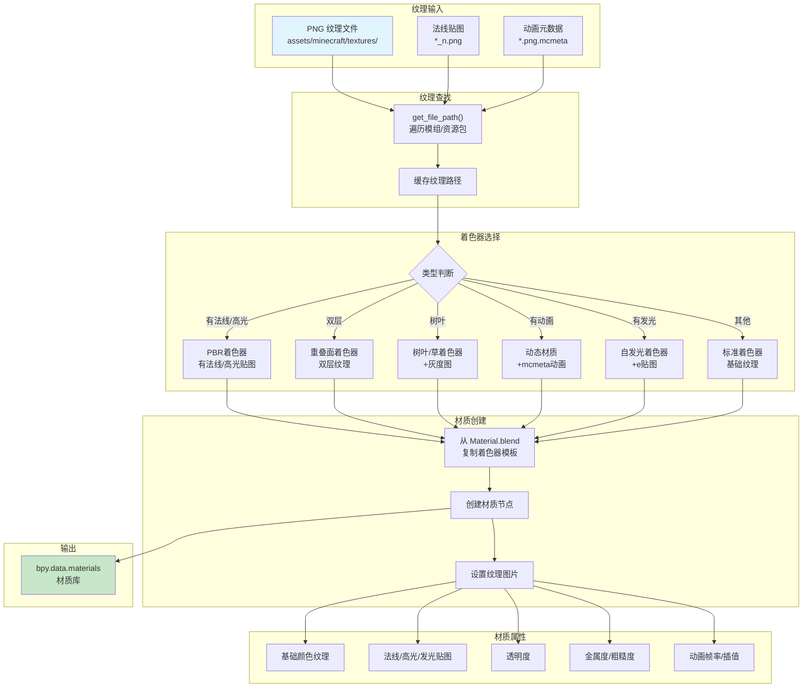
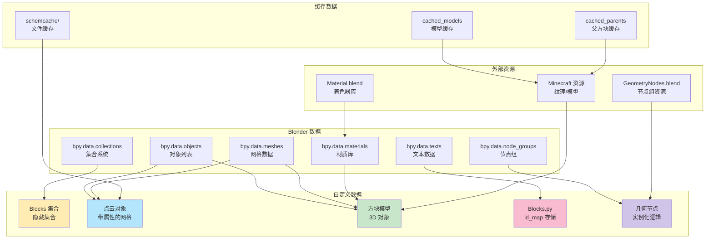

# MBM-workflow 插件数据转化图

本文档详细描述 MBM-workflow (BaiGave's Tool) 插件中各种数据转化的流程。

## 目录

1. [方块注册流程](#1-方块注册流程)
2. [导入流程](#2-导入流程)
3. [导出流程](#3-导出流程)
4. [坐标系统转换](#4-坐标系统转换)
5. [材质系统流程](#5-材质系统流程)
6. [数据结构关系](#6-数据结构关系)

---

## 1. 方块注册流程

方块注册是将 Minecraft 的方块状态转换为 Blender 中可渲染的 3D 模型的核心流程。



### 关键函数说明

| 函数 | 文件位置 | 作用 |
|------|----------|------|
| `register_blocks()` | `codes/register.py:20-81` | 注册方块到 Blocks 集合 |
| `block()` | `codes/block.py:76-238` | 创建单个方块对象 |
| `get_model()` | `codes/blockstates.py:199-306` | 解析方块状态和模型 |
| `get_all_data()` | `codes/functions/get_data.py:47-85` | 提取模型数据 |

### 数据结构

**id_map 格式**:
```python
{
    "minecraft:stone": 0,
    "minecraft:grass_block[snowy=true]": 1,
    "minecraft:oak_log[axis=x]": 2,
    ...
}
```

---

## 2. 导入流程

导入流程将 Minecraft 世界文件转换为 Blender 中的点云预览。



### 核心函数

| 函数 | 文件位置 | 作用 |
|------|----------|------|
| `schem()` | `codes/schem.py:29-136` | 创建点云并应用几何节点 |
| `schem_chunk()` | `codes/schem.py:139-172` | 分区块处理（多进程） |
| `schem_liquid()` | `codes/schem.py:176-447` | 流体方块处理 |

### 顶点属性结构

```
每个顶点包含三个属性：
┌─────────────────────────────────────┐
│  顶点 (x, y, z)                      │
├─────────────────────────────────────┤
│  blockid: INT      (方块数字ID)      │
│  waterlogged: INT  (含水状态 0/1)   │
│  biome: FLOAT_COLOR (群系颜色 RGBA) │
└─────────────────────────────────────┘
```

---

## 3. 导出流程

导出流程将 Blender 场景转换回 Minecraft 格式。



### 核心函数

| 函数 | 文件位置 | 作用 |
|------|----------|------|
| `ExportSchem.execute()` | `codes/exportfile.py:43-116` | 导出为 .schem 文件 |
| `ExportToSave.execute()` | `codes/exportfile.py:262-361` | 导出到世界存档 |
| `export_schem()` | `codes/exportfile.py:118-177` | NBT 数据构建 |

### NBT 结构

```
schem 文件结构:
┌─────────────────────────────────────────┐
│  TAG_Compound (根)                       │
├─────────────────────────────────────────┤
│  DataVersion: TAG_Int(3465)             │
│  Version: TAG_Int(2)                    │
│  Metadata: TAG_Compound                 │
│  Palette: TAG_Compound                  │
│    ├─ minecraft:air: TAG_Int(0)         │
│    ├─ minecraft:stone: TAG_Int(1)       │
│    └─ ...                               │
│  PaletteMax: TAG_Int                    │
│  Width: TAG_Short                       │
│  Height: TAG_Short                      │
│  Length: TAG_Short                      │
│  BlockData: TAG_ByteArray               │
│  Offset: TAG_IntArray                   │
└─────────────────────────────────────────┘
```

---

## 4. 坐标系统转换

Minecraft 和 Blender 使用不同的坐标系统，需要进行转换。

```mermaid
graph LR
    subgraph MC["Minecraft 坐标系统"]
        MC["X: 东西<br/>Y: 高度<br/>Z: 南北"]
    end

    subgraph Conversion["转换规则"]
        RULE1["x → x (保持不变)"]
        RULE2["y → z (高度变成Z轴)"]
        RULE3["z → -y (反向+交换)"]
    end

    subgraph Blender["Blender 坐标系统"]
        BC["X: 东西<br/>Y: 南北<br/>Z: 高度"]
    end

    MC -->|"x,y,z"| Conversion
    Conversion -->|"x,-z,y"| Blender

    MC2["MC(1, 64, 1)<br/>地面位置"] --> CONV["转换"]
    CONV --> BL["Blender(1, -1, 64)<br/>对应位置"]

    style MC fill:#8d6e63
    style Blender fill:#42a5f5
```

### 转换公式

```python
# Minecraft → Blender
blender_x = mc_x
blender_y = -mc_z
blender_z = mc_y

# Blender → Minecraft
mc_x = blender_x
mc_y = blender_z
mc_z = -blender_y
```

### 实际代码位置

| 位置 | 代码 | 说明 |
|------|------|------|
| `codes/schem.py:86` | `(x-min_x, -(z-min_z), y-min_y)` | 导入时坐标转换 |
| `codes/exportfile.py:355` | `level.set_version_block(x, z, -y, ...)` | 导出时坐标转换 |

---

## 5. 材质系统流程

材质系统将 Minecraft 纹理转换为 Blender 着色器材质。



### 着色器类型

| 着色器 | 条件 | 节点来源 |
|--------|------|----------|
| PBR着色器 | 存在 `*_n.png` 或 `*_s.png` | `Material.blend` |
| 重叠面着色器 | 双层纹理 | `Material.blend` |
| 树叶/草着色器 | `block_type.Type1` | `Material.blend` |
| 动态材质 | 存在 `.mcmeta` | `Material.blend` |
| 自发光着色器 | 存在 `*_e.png` | `Material.blend` |
| 标准着色器 | 默认 | `Material.blend` |

### 核心函数

| 函数 | 文件位置 | 作用 |
|------|----------|------|
| `create_node_material()` | `codes/model.py:9-279` | 创建材质和着色器 |
| `get_or_create_material()` | `codes/model.py` | 获取或创建材质 |

---

## 6. 数据结构关系

展示插件中核心数据结构之间的关系。



### 核心数据结构

**Blocks 集合**:
```
Blocks/
├── 0#minecraft:air
├── 1#minecraft:stone
├── 2#minecraft:grass_block[snowy=true]
└── ...
```

**点云对象属性**:
```
点云网格:
- vertices: [(x1,y1,z1), (x2,y2,z2), ...]
- blockid: [0, 1, 2, ...]
- waterlogged: [0, 1, 0, ...]
- biome: [(r,g,b,a), ...]
- modifier: Geometry Nodes "Schem"
```

---

## 附录

### 关键文件索引

| 文件 | 核心功能 |
|------|----------|
| `codes/register.py` | 方块注册系统 |
| `codes/schem.py` | 导入和点云创建 |
| `codes/exportfile.py` | 导出功能 |
| `codes/blockstates.py` | 方块状态解析 |
| `codes/block.py` | 方块对象创建 |
| `codes/model.py` | 材质系统 |
| `codes/functions/get_data.py` | 数据获取 |
| `codes/functions/surface_optimization.py` | 面优化算法 |
| `codes/functions/sway_animation.py` | 植物摇摆动画 |

### 外部依赖

| 文件 | 用途 |
|------|------|
| `codes/blend_files/GeometryNodes.blend` | Schem 节点组 |
| `codes/blend_files/Material.blend` | 材质着色器库 |
| `site-packages.zip` | Python 依赖 (amulet, amulet_nbt) |

### 版本兼容性

- **Blender**: 5.0+
- **Python**: 3.x
- **Minecraft**: Java Edition 1.20.4
- **Amulet**: 最新稳定版
